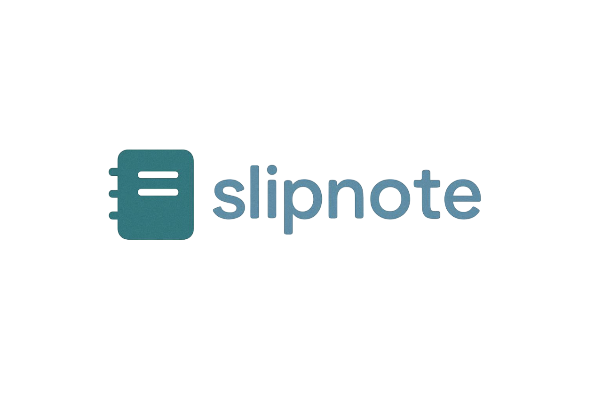

# Slipnote

**Slipnote** — это небольшой PET-проект для работы с заметками, который позволяет создавать, редактировать и организовывать
заметки с возможностью полнотекстового поиска. Проект включает REST API на Symfony с JWT-аутентификацией.

## ✨ Возможности

- ✅ Создание / редактирование/ удаление
- 🔍 Поиск по название и содержимому
- 🔐 JWT-аутентификация
- 📊 API архитектура с полной документацией OpenAPI

## 🛠️ Технологический стек

- Symfony 8.0
- PostgreSQL + Doctrine
- JWT-аутентификация (LexikJWTAuthenticationBundle)
- Rector + PHPStan + PHP-CS-Fixer
- Docker

## 🚀 Быстрый старт

- Клонировать проект

```bash
https://github.com/armhaina/slipnote.git
```

- Перейти в проект

```bash
cd slipnote
```

- Запустить проект

```bash
make up
```

## 📚 API Документация

API документация доступна после запуска проекта по адресу: `http://localhost:8000/api/doc`

## 🧪 Тестирование

- Инициализация тестовой базы

```bash
make test-init
```

- Запуск тестов

```bash
make test-run
```

## 📄 Лицензия

[](LICENSE)

Распространяется под лицензией MIT.

**Кратко о лицензии MIT:**
- ✅ Можно свободно использовать, копировать, изменять, распространять
- ✅ Можно использовать в коммерческих проектах
- ✅ Не нужно открывать исходный код производных работ
- 📋 Единственное условие — сохранить уведомление об авторских правах и лицензии

Полный текст лицензии доступен в файле [LICENSE](LICENSE)
